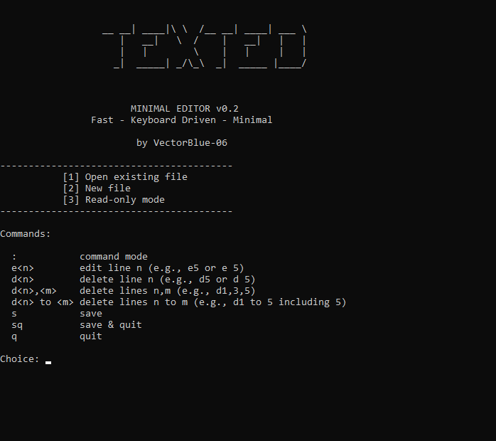

# TextEd (Discontinued)
A minimal terminal-based text editor written in C++ for Windows.

##  Features
- Open, edit, and save text files
- Simple keyboard-driven controls
- Lightweight and fast
- Built using standard C++

##  Build

Single file to compile.

```bash
g++ main.cpp -o texted
```

## Release

https://github.com/VectorBlue-06/Texed/releases


## TEXTED - Minimal Text Editor — v0.2

<p align="center">
  
</p>


A lightweight, keyboard-driven console text editor for Windows.

### Features
- Menu-based startup:
  - Open existing file
  - Create new file
  - Read-only mode
- Command mode (`:`) with:
  - `e <n>` edit line
  - `s` save
  - `sq` save & quit
  - `q` quit
  - `d <n>` to delete a single line
  - `d <n>,<m>` to delete given lines
  - `d <n> to <m>` to delete multiple lines from n to m including m and n
- Improved line editor:
  - Arrow keys + Home/End
  - ESC cancels edit safely
- Read-only mode enforcement (no edit/save)
- Colored console UI (Not working properly)

### Fixes & Improvements
- Safe file saving using temporary file swap
- Fixed cursor redraw and ESC deletion bug
- Cleaner command parsing and state handling
- And other bugs fixed

### Platform
- Windows only (WinAPI based)
- Cross-platform support coming soon...

### Planned
- Undo/redo
- Search
- Status bar
- Cross-platform support
- Color
